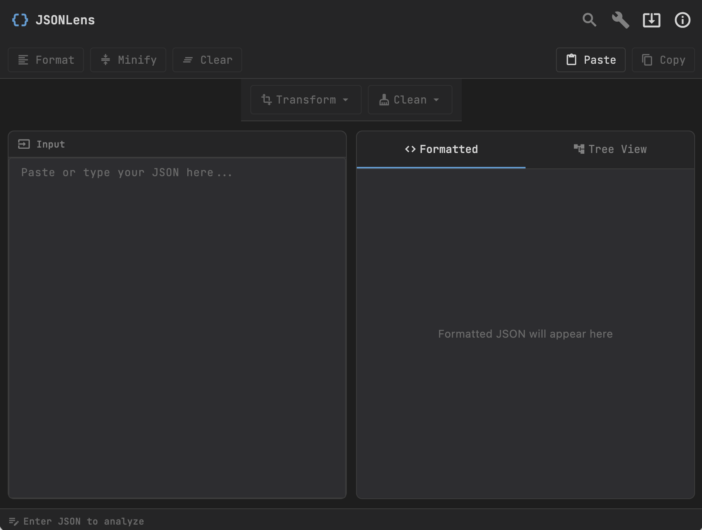
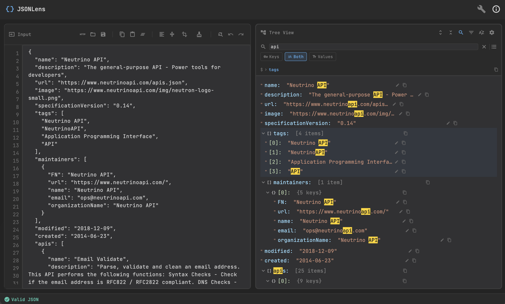
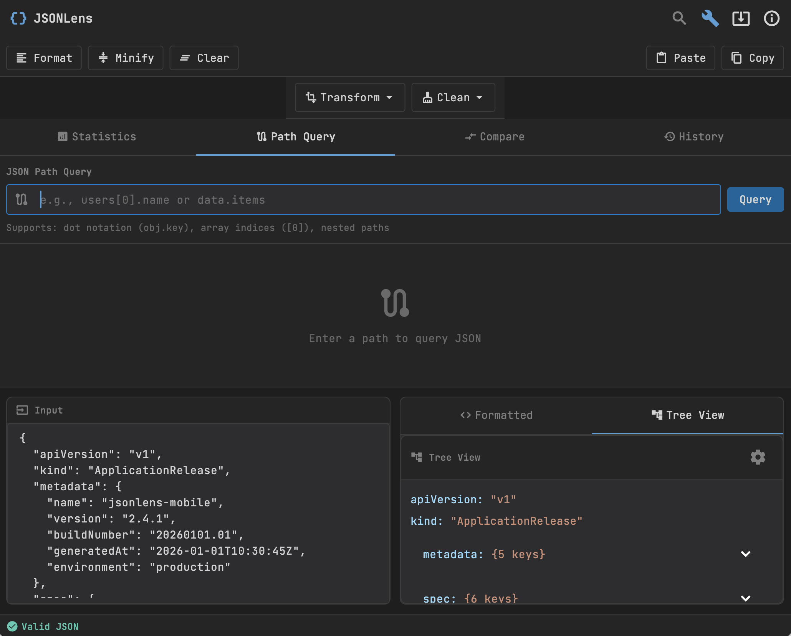
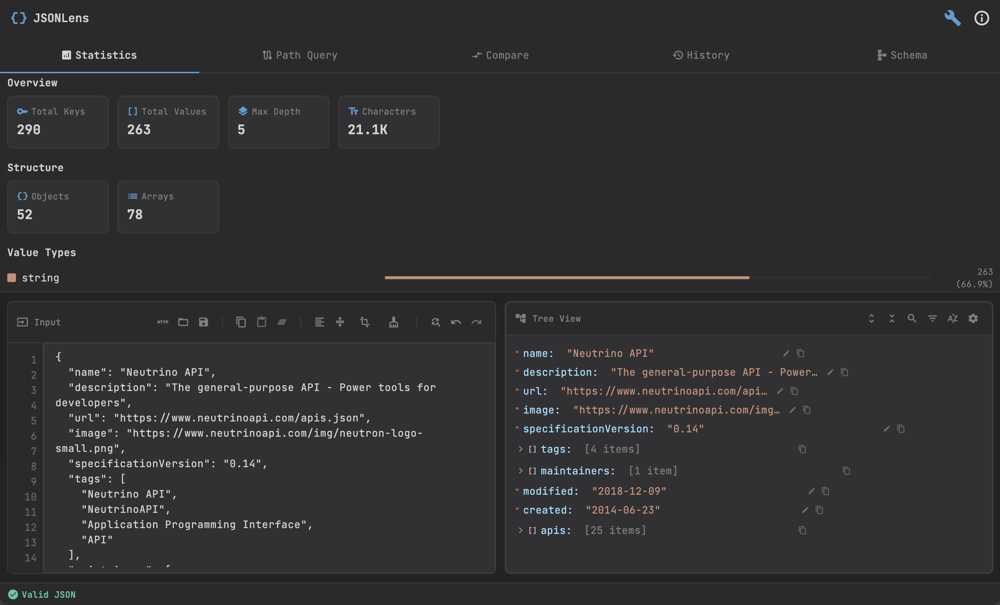

# jsonlens 🔎📁

[](./LICENSE)

**JSONLens** — A professional Flutter application for analyzing, formatting, and exploring JSON (Dark Mode by default).

## 🚀 Key Features
- Display and format JSON using 2-space indentation
- Real-time validation with descriptive error messages (line number and reason)
- Syntax highlighting with JetBrains Mono font
- Expandable/collapsible JSON tree view
- Toolbar: Format, Minify, Clear, Copy, Paste
- Validation indicator: Valid (green) / Invalid (red)

## 📥 Downloads

Download pre-built release binaries for quick installation on your desktop. All releases are provided as-is from the repository.

### macOS

[](release/macos/jsonlens.app.zip)

**Installation:**
1. Download `jsonlens.app.zip`
2. Unzip the archive to extract `jsonlens.app`
3. Move `jsonlens.app` to your **/Applications** folder
4. Right-click and select **Open** to launch (macOS security prompt may appear on first run)

> **Note:** If you encounter security warnings, open System Preferences → Security & Privacy → General and click "Open Anyway".

### Windows

[](release/windows/jsonlens.zip)

**Installation:**
1. Download `jsonlens.zip`
2. Extract the contents to a folder of your choice
3. Run `jsonlens.exe` from the extracted folder
4. Optionally create a desktop shortcut for quick access

> **Note:** Windows Defender may flag unsigned binaries. You can safely run the application by clicking "More info" → "Run anyway".

### Build from Source

For mobile platforms (iOS, Android) or custom builds, please refer to the **[Build Instructions](#-build---debug--release-by-platform)** section below.

---

### Release Information

- **Artifacts:** Release binaries are stored in the `release/` directory of this repository
- **Updates:** Check this repository for the latest releases and updates
- **Signed Builds:** Currently, releases are unsigned. For signed installers or notarized macOS builds, please contact the maintainers or check official release channels

## 🔒 Privacy & Offline-first
- **Local-first operation:** The app runs entirely locally and does not require a network connection to perform JSON editing, validation, formatting, or tree browsing.
- **Network use is limited:** The app only uses the network to check for a *new app version* (fetching a small metadata record). This check is **cached** (default TTL 1 hour) to avoid frequent requests.
- **No tracking / no telemetry:** JSONLens does **not** collect analytics or tracking data. There is no background data tracking or user behavior analytics sent anywhere by default.
- **No access to personal files:** The app does not read or upload user files, directories, or other personal data on the device; clipboard operations (copy/paste) remain local to the OS clipboard.

## 🧩 Technology & Libraries
- Flutter
- State management: Riverpod (`flutter_riverpod`)
- Syntax highlighting: `flutter_highlight`
- Font: `google_fonts` (JetBrains Mono)
- JSON tree view: `flutter_json_view`
- Clipboard utilities: `flutter/services`

## 📷 Screenshots

_Showcase: concise, professional visual overview of key UI flows._

| Input area & Toolbar | Tree view (expanded) |
|---|---|
|  |  |
| Quick editing, formatting, and clipboard actions. | Lazy, virtualized tree for exploring large JSON documents. |

| Path Query Panel | Statistics Panel |
|---|---|
|  |  |
| Query JSON paths and filter results. | View JSON statistics and metrics at a glance. |

---

**Note:** For additional images see the `/screenshots` folder in the repository.

## 🛠️ Requirements
- Flutter SDK (stable)
- For iOS/macOS builds: macOS with Xcode and CocoaPods
- For Windows builds: Visual Studio (Desktop development workload) and required toolchain
- For Linux builds: standard desktop toolchain (GCC, etc.)

## ⚡ Quick Start
1. Install dependencies:

```bash
flutter pub get
```

2. Run the app on a device or emulator:

```bash
flutter run
```

3. Run tests:

```bash
flutter test
```

4. Format source code:

```bash
dart format .
```

---

## 🧰 Build — Debug & Release (by platform)

> Note: Flutter supports `debug`, `profile`, and `release` build modes.

### Android
- Run on a connected device or emulator:

```bash
flutter run -d <device-id>
```

- Build debug APK:

```bash
flutter build apk --debug
```

- Build release APK:

```bash
flutter build apk --release
```

- Build Android App Bundle (recommended for Play Store):

```bash
flutter build appbundle --release
```

- Install APK to a device using ADB:

```bash
adb install -r build/app/outputs/flutter-apk/app-release.apk
```

---

### iOS (requires macOS + Xcode)
- Run on a connected device or simulator:

```bash
flutter run -d <device-id>
```

- Build iOS app (Xcode project):

```bash
flutter build ios --release
```

- Build IPA for distribution:

```bash
flutter build ipa --export-options-plist=path/to/ExportOptions.plist
```

> Note: App Store distribution requires proper signing, provisioning profiles, and Xcode archiving.

---

### macOS
- Run in debug:

```bash
flutter run -d macos
```

- Build release:

```bash
flutter build macos --release
```

> Note: Code signing and notarization may be required for distribution.

---

### Windows
- Run in debug:

```bash
flutter run -d windows
```

- Build release (manual):

```bash
flutter build windows --release
```

- Build release (recommended: packaged ZIP via script):

Run the provided PowerShell script from the project root on a Windows machine to build and package a release ZIP:

```powershell
# From project root in PowerShell
.\tool\release\build_windows_release.ps1
```

The script performs the following steps:
- Ensures Flutter dependencies (`flutter pub get`)
- Builds a release (`flutter build windows --release`)
- Collects build outputs from `build/windows/runner/Release`
- Creates a ZIP artifact at `release/windows/<AppName>.zip` and removes the temporary copied folder

> Notes:
> - Make sure you run the script on Windows and have Flutter and Visual Studio (Desktop development workload) installed and in PATH.
> - If PowerShell execution policy prevents running the script, run it with an explicit bypass: `powershell -ExecutionPolicy Bypass -File .\tool\release\build_windows_release.ps1`.
> - To keep the unpacked release folder instead of removing it, edit the script and comment out the line that deletes the temporary folder.

> Note: Consider creating an installer (MSIX, Inno Setup, NSIS, etc.) for user-friendly distribution.

---

### Linux
- Run in debug:

```bash
flutter run -d linux
```

- Build release:

```bash
flutter build linux --release
```

> Note: Package the app as `.deb`, `.rpm`, or other distro-specific formats for distribution.

---

## 💡 Development Tips
- Use profile mode to evaluate performance:

```bash
flutter run --profile
```

- Build for specific flavors or target platforms using `--flavor` and `--target-platform` as needed.

## ✅ Contribution Guidelines
- Follow coding standards described in `AGENTS.md`.
- Write unit and widget tests for new features.
- Open clear pull requests with descriptions and screenshots when UI changes occur.

## 📖 License
This project is licensed under the **MIT License** — see the [LICENSE](./LICENSE) file for details.

---

## 📬 Contact & Tech Stack

**Company:** NAVARO DIGITAL TECHNOLOGY COMPANY LIMITED

**Contact**
- **Microsoft Teams:** pnvinh83@gmail.com
- **WhatsApp / Telegram / Zalo:** +84 90 866 28 65

**Primary Technologies**
- **Frontend:** Flutter, React, Next.js, React Native, Vue.js, Angular, Svelte, TypeScript, JavaScript, HTML5, CSS3
- **Backend:** Node.js (Express, NestJS), Python (FastAPI), Go, .NET (C#), PHP (Laravel)
- **Databases & Storage:** PostgreSQL, MySQL, MongoDB, Redis, SQLite, Amazon S3
- **DevOps & CI/CD:** Docker, Kubernetes, GitHub Actions, GitLab CI, CircleCI, Terraform
- **Cloud Providers:** AWS, Google Cloud Platform (GCP), Microsoft Azure, Firebase

**Partnership & Recruitment Inquiries**
NAVARO DIGITAL TECHNOLOGY COMPANY LIMITED welcomes discussions with investors, strategic partners, and organizations seeking technical collaboration or recruitment. For investment proposals, partnership opportunities, or hiring inquiries, please contact us using the channels above and include a brief summary of your request. Our team aims to respond within two business days.
